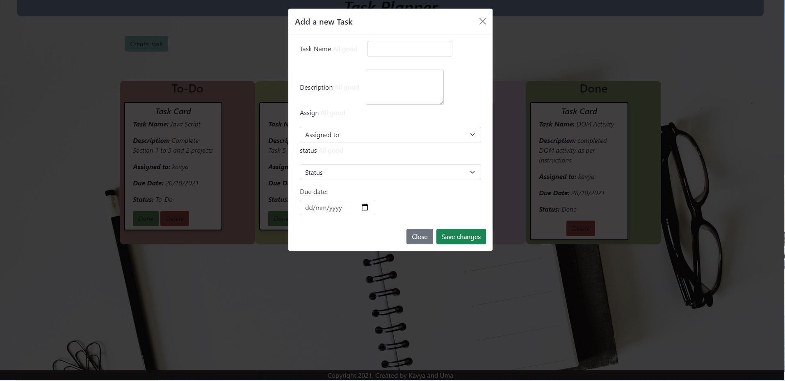

# TaskPlanner-Project
Created By Uma, Kavya
## About Project
- Task planner project created from Start to end, This project main aim is to add task,display task, task status to Done and delete task.
### WireFrame

## Features 
- Click on Create Task  from Home page.
- complete form by filling all details - All labels "MUST" be filled.
- Cards will be sorted according to status selection (To Do, In progress, Review, Done)
- you can delete completed cards by clicking "Delete" button 
  

##  Software/Programming languages
- HTML
- CSS
- BootStrap 5.1.3
- GitHub,Gitbash
- VS code
- Java Script
- Local storage browser
- Crome for devtools 

## Final Page Look

## GitHub Page
[GitHub Page](https://kavya-88.github.io/TaskPlanner-Project/)